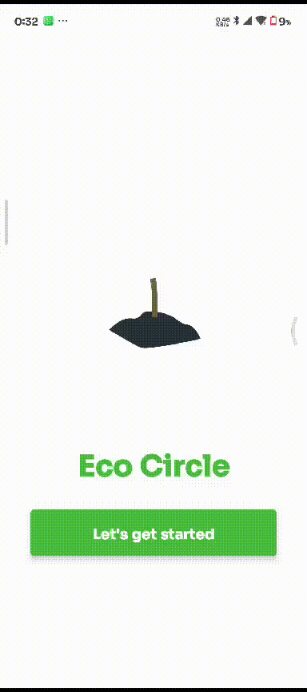
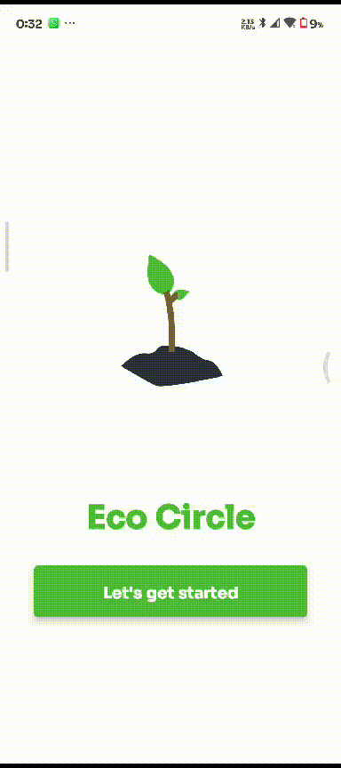

# EcoCircle App 🌿

**EcoCircle** is a social mobile application designed to inspire sustainable living and increase environmental awareness. Built with **React Native** and **Expo**, the app empowers users to share their eco-friendly journey, connect with like-minded individuals, and participate in building a greener community.

## 🌟 Features

### 🔐 **User Authentication**

- Secure sign-in and account management using **Supabase Auth**
- Email/password authentication with email verification
- Persistent user sessions
- Profile management with user initials display

### 📱 **Community Posts**

- Create and share eco-friendly posts with the community
- Upload photos to showcase your sustainable activities
- Categorize posts (Tree Planting, Sustainability, Transport, etc.)
- Like and interact with community posts
- Real-time post feed with pull-to-refresh

### 🤖 **AI Content Moderation**

- Automatic post validation using **Google Gemini AI**
- Ensures all content is eco-friendly and appropriate
- Smart content filtering for community safety
- Helpful suggestions for improving posts

### 👤 **User Profiles**

- Personalized profile pages with user statistics
- Track your posts, likes, and community engagement
- View your eco-friendly contributions over time
- Compact profile design with essential information

### 💬 **Community Interaction**

- Comment on posts (coming soon)
- Like and engage with community content
- Delete your own posts with confirmation
- Real-time interaction feedback

### 📊 **Statistics & Analytics**

- Track your total posts and community engagement
- View likes and comments received
- Monitor your environmental impact contributions
- Achievement tracking for sustainable activities

## 📱 Screenshots & GIFs

### Landing Page

<div style="display: flex; gap: 10px;">
- 
- 
</div>

### Home & Profile Pages

<div style="display: flex; gap: 10px;">
- 
- 
</div>

<div style="display: flex; gap: 10px;">
- 
- 
</div>
## 🛠 Technologies Used

- **React Native**: Core framework for building the cross-platform mobile app
- **Expo**: Development platform and tools for React Native
- **Supabase**: Backend-as-a-Service for authentication and database
- **Google Gemini AI**: AI-powered content moderation and validation
- **@gorhom/bottom-sheet**: Modern bottom sheet implementation
- **@shopify/flash-list**: High-performance list component
- **expo-image-picker**: Camera and photo library integration
- **expo-router**: File-based navigation system
- **React Native Reanimated**: Smooth animations and interactions

## 🚀 Getting Started

### Prerequisites

- Node.js (v18 or higher)
- npm or yarn
- Expo CLI
- iOS Simulator (for iOS development) or Android Studio (for Android development)

### Installation

1. **Clone the repository**

   ```bash
   git clone https://github.com/yourusername/EcoCircle.git
   cd EcoCircle
   ```

2. **Install dependencies**

   ```bash
   npm install
   ```

3. **Set up environment variables**

   Create a `.env` file in the root directory:

   ```bash
   EXPO_PUBLIC_SUPABASE_URL=your_supabase_project_url
   EXPO_PUBLIC_SUPABASE_ANON_KEY=your_supabase_anon_key
   EXPO_PUBLIC_GEMINI_API_KEY=your_gemini_api_key
   ```

4. **Start the development server**

   ```bash
   npx expo start
   ```

5. **Run on your preferred platform**
   - Press `i` for iOS simulator
   - Press `a` for Android emulator
   - Scan QR code with Expo Go app on your device

## 🏗 Project Structure

```
EcoCircle/
├── app/                    # App screens and navigation
│   ├── (tabs)/            # Tab-based navigation
│   │   ├── home.jsx       # Home feed screen
│   │   ├── posts.jsx      # Community posts screen
│   │   └── profile.jsx    # User profile screen
│   └── index.tsx          # Landing/Auth screen
├── components/            # Reusable UI components
│   ├── PostCard.tsx       # Post display component
│   ├── CreatePostModal.tsx # Post creation modal
│   └── CommentModal.tsx   # Comments modal
├── context/               # React Context providers
│   ├── authcontext.tsx    # Authentication context
│   └── postsContext.tsx   # Posts data context
├── services/              # API and external services
│   ├── supabase.ts        # Supabase configuration
│   ├── postsService.ts    # Posts API service
│   └── geminiValidationService.ts # AI validation
└── utils/                 # Utility functions
```

## 🔧 Configuration

### Supabase Setup

1. Create a new Supabase project
2. Set up authentication with email/password
3. Create the required database tables
4. Configure storage buckets for image uploads
5. Add your Supabase URL and anon key to environment variables

### Google Gemini AI Setup

1. Get a Gemini API key from Google AI Studio
2. Add the API key to your environment variables
3. Configure content validation parameters

## 🌍 Environmental Variables

The app uses the following environment variables:

- `EXPO_PUBLIC_SUPABASE_URL`: Your Supabase project URL
- `EXPO_PUBLIC_SUPABASE_ANON_KEY`: Your Supabase anonymous key
- `EXPO_PUBLIC_GEMINI_API_KEY`: Your Google Gemini API key

For production builds, use EAS environment variables:

```bash
eas env:create --name EXPO_PUBLIC_SUPABASE_URL --value "your_url"
eas env:create --name EXPO_PUBLIC_SUPABASE_ANON_KEY --value "your_key"
eas env:create --name EXPO_PUBLIC_GEMINI_API_KEY --value "your_api_key"
```

---

**Made with 💚 for a sustainable future**

_EcoCircle - Building a greener world, one post at a time._
